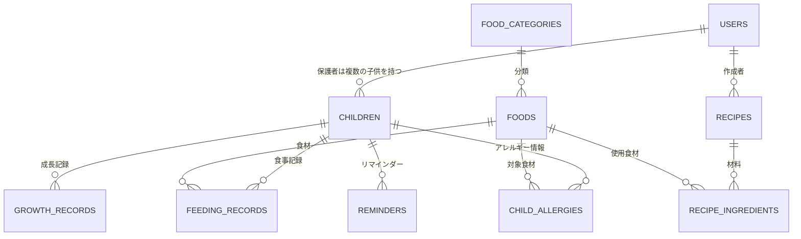

# 離乳食管理アプリ データベース設計書（Laravel）

## 1. アプリ概要

離乳食管理アプリの主な目的は以下の3つです。

- **子供ごとの離乳食記録**（いつ・何を・どれくらい食べたか）
- **初めて食べた食材の管理**（アレルギー確認のため特に重要）
- **成長記録**（体重・身長など）との連携

これらを踏まえ、想定する主要機能は次の通りです。

- 複数の子供（兄弟）を登録・切り替えて管理できる
- 食材マスタ（月齢目安・アレルギー特定原材料28品目など）を保持
- 食べた記録をカレンダー/タイムラインで表示
- 初めて食べた食材への反応（アレルギー症状）を記録
- レシピの保存・食材との紐付け
- 成長記録（体重・身長）のグラフ表示
- リマインダー通知（そろそろ次の食材に挑戦など）

---

## 2. ER図（概要）



---

## 3. テーブル設計

### 3.1 users（利用者・保護者）
Laravel標準の`users`テーブルをベースに利用します。

| カラム名 | 型 | 説明 |
|---|---|---|
| id | bigint (PK) | |
| name | varchar | 保護者名 |
| email | varchar (unique) | |
| password | varchar | |
| email_verified_at | timestamp (nullable) | |
| created_at / updated_at | timestamp | |

### 3.2 children（子供）

| カラム名 | 型 | 説明 |
|---|---|---|
| id | bigint (PK) | |
| user_id | bigint (FK → users) | 保護者 |
| name | varchar | 子供の名前 |
| birthday | date | 生年月日（月齢計算に使用） |
| gender | tinyint / enum | 性別（任意項目） |
| avatar_path | varchar (nullable) | アイコン画像 |
| created_at / updated_at | timestamp | |

### 3.3 food_categories（食材カテゴリ）

| カラム名 | 型 | 説明 |
|---|---|---|
| id | bigint (PK) | |
| name | varchar | 例：穀類、野菜、果物、たんぱく質 など |
| sort_order | int | 表示順 |

### 3.4 foods（食材マスタ）

| カラム名 | 型 | 説明 |
|---|---|---|
| id | bigint (PK) | |
| food_category_id | bigint (FK) | |
| name | varchar | 食材名 |
| recommended_month_min | int (nullable) | 食べ始め推奨月齢（下限） |
| recommended_month_max | int (nullable) | 上限（任意） |
| is_specified_allergen | boolean | 特定原材料（卵・乳・小麦など）該当フラグ |
| allergen_type | varchar (nullable) | アレルギー表示区分名 |
| notes | text (nullable) | 調理の注意点など |

> 食材マスタは初期データとして厚生労働省の離乳食ガイドラインなどを参考にシーディング（Seeder）しておくと便利です。

### 3.5 feeding_records（離乳食の記録）

| カラム名 | 型 | 説明 |
|---|---|---|
| id | bigint (PK) | |
| child_id | bigint (FK → children) | |
| food_id | bigint (FK → foods) | |
| fed_at | date | 食べた日 |
| meal_time | enum(morning, noon, evening, snack) | 食事のタイミング |
| is_first_time | boolean | その子にとって初めての食材か |
| reaction | enum(none, mild, severe) | アレルギー反応の有無 |
| reaction_note | text (nullable) | 症状の詳細メモ |
| amount | varchar (nullable) | 量（例：スプーン2杯） |
| photo_path | varchar (nullable) | 食事の写真 |
| memo | text (nullable) | 自由記述メモ |
| created_at / updated_at | timestamp | |

- `is_first_time` は保存時に「同じchild_id×food_idの記録が過去に存在するか」で自動判定するロジックをサービス層に持たせると良いです。
- `child_id + food_id + fed_at` に複合インデックスを張っておくと検索が高速化します。

### 3.6 child_allergies（子供ごとのアレルギー情報）

| カラム名 | 型 | 説明 |
|---|---|---|
| id | bigint (PK) | |
| child_id | bigint (FK) | |
| food_id | bigint (FK) | |
| severity | enum(mild, moderate, severe) | 重症度 |
| diagnosed_at | date (nullable) | 診断日 |
| note | text (nullable) | 病院での指示内容など |

feeding_recordsの`reaction`だけでも簡易記録は可能ですが、医師の診断が出た確定的なアレルギー情報は別テーブルで正として管理すると、レシピ提案時の除外フィルタなどに使いやすくなります。

### 3.7 growth_records（成長記録）

| カラム名 | 型 | 説明 |
|---|---|---|
| id | bigint (PK) | |
| child_id | bigint (FK) | |
| recorded_at | date | 記録日 |
| weight_g | int (nullable) | 体重（グラム） |
| height_mm | int (nullable) | 身長（ミリ） |
| note | text (nullable) | |

### 3.8 recipes（レシピ）

| カラム名 | 型 | 説明 |
|---|---|---|
| id | bigint (PK) | |
| user_id | bigint (FK) | 作成者 |
| title | varchar | レシピ名 |
| target_month_min | int (nullable) | 対象月齢 |
| steps | text | 作り方（Markdown保存推奨） |
| photo_path | varchar (nullable) | |
| created_at / updated_at | timestamp | |

### 3.9 recipe_ingredients（レシピの材料：中間テーブル）

| カラム名 | 型 | 説明 |
|---|---|---|
| id | bigint (PK) | |
| recipe_id | bigint (FK) | |
| food_id | bigint (FK) | |
| amount | varchar (nullable) | 分量 |

### 3.10 reminders（リマインダー・任意機能）

| カラム名 | 型 | 説明 |
|---|---|---|
| id | bigint (PK) | |
| child_id | bigint (FK) | |
| title | varchar | 例：「そろそろ卵に挑戦してみよう」 |
| remind_at | datetime | 通知日時 |
| is_sent | boolean | |

---

## 4. マイグレーション例（抜粋）

```php
// database/migrations/xxxx_xx_xx_create_children_table.php
Schema::create('children', function (Blueprint $table) {
    $table->id();
    $table->foreignId('user_id')->constrained()->cascadeOnDelete();
    $table->string('name');
    $table->date('birthday');
    $table->tinyInteger('gender')->nullable();
    $table->string('avatar_path')->nullable();
    $table->timestamps();
});

// database/migrations/xxxx_xx_xx_create_foods_table.php
Schema::create('foods', function (Blueprint $table) {
    $table->id();
    $table->foreignId('food_category_id')->constrained()->cascadeOnDelete();
    $table->string('name');
    $table->unsignedTinyInteger('recommended_month_min')->nullable();
    $table->unsignedTinyInteger('recommended_month_max')->nullable();
    $table->boolean('is_specified_allergen')->default(false);
    $table->string('allergen_type')->nullable();
    $table->text('notes')->nullable();
    $table->timestamps();
});

// database/migrations/xxxx_xx_xx_create_feeding_records_table.php
Schema::create('feeding_records', function (Blueprint $table) {
    $table->id();
    $table->foreignId('child_id')->constrained()->cascadeOnDelete();
    $table->foreignId('food_id')->constrained()->cascadeOnDelete();
    $table->date('fed_at');
    $table->enum('meal_time', ['morning', 'noon', 'evening', 'snack']);
    $table->boolean('is_first_time')->default(false);
    $table->enum('reaction', ['none', 'mild', 'severe'])->default('none');
    $table->text('reaction_note')->nullable();
    $table->string('amount')->nullable();
    $table->string('photo_path')->nullable();
    $table->text('memo')->nullable();
    $table->timestamps();

    $table->index(['child_id', 'food_id', 'fed_at']);
});
```

---

## 5. Eloquentモデルとリレーション例

```php
// app/Models/Child.php
class Child extends Model
{
    public function user(): BelongsTo
    {
        return $this->belongsTo(User::class);
    }

    public function feedingRecords(): HasMany
    {
        return $this->hasMany(FeedingRecord::class);
    }

    public function growthRecords(): HasMany
    {
        return $this->hasMany(GrowthRecord::class);
    }

    public function allergies(): HasMany
    {
        return $this->hasMany(ChildAllergy::class);
    }

    // 生年月日から月齢を計算するアクセサ
    public function getMonthAgeAttribute(): int
    {
        return $this->birthday->diffInMonths(now());
    }
}

// app/Models/FeedingRecord.php
class FeedingRecord extends Model
{
    protected $casts = [
        'fed_at' => 'date',
        'is_first_time' => 'boolean',
    ];

    public function child(): BelongsTo
    {
        return $this->belongsTo(Child::class);
    }

    public function food(): BelongsTo
    {
        return $this->belongsTo(Food::class);
    }
}
```

「初めての食材か」を保存前に自動判定する例（Observerパターン推奨）：

```php
// app/Observers/FeedingRecordObserver.php
class FeedingRecordObserver
{
    public function creating(FeedingRecord $record): void
    {
        $exists = FeedingRecord::where('child_id', $record->child_id)
            ->where('food_id', $record->food_id)
            ->exists();

        $record->is_first_time = ! $exists;
    }
}
```

---

## 6. おすすめパッケージ・技術構成

| 用途 | パッケージ/技術 |
|---|---|
| 認証 | Laravel Breeze または Fortify + Sanctum（SPA/モバイル対応する場合） |
| 画像アップロード | Laravel標準の`Storage`（S3 or ローカル） + Intervention Image（リサイズ） |
| フロントエンド | Livewire（サーバーサイド完結で開発が速い）または Inertia.js + Vue/React |
| グラフ表示（成長記録） | Chart.js または ApexCharts |
| 通知 | Laravel Notification + キュー（メール/プッシュ通知） |
| 管理画面（食材マスタ管理） | Filament（管理画面を素早く構築可能） |
| テスト | Pest または PHPUnit |

---

## 7. 開発ステップの提案

1. **基盤構築**：Laravel Breeze/Fortifyで認証を用意し、`users`と`children`のCRUDを実装
2. **食材マスタ整備**：`food_categories`・`foods`テーブルとSeederを用意（月齢ガイドラインの初期データ投入）
3. **記録機能**：`feeding_records`のCRUD、初回食材の自動判定ロジック
4. **アレルギー管理**：`child_allergies`との連携、記録画面での警告表示（例：診断済みアレルギー食材を選ぼうとしたら警告）
5. **成長記録・グラフ**：`growth_records`とChart.jsでの可視化
6. **レシピ機能**：`recipes`/`recipe_ingredients`のCRUD、食材からレシピを逆引き検索
7. **通知機能**：リマインダーのバッチ処理（Laravel Scheduler + Queue）

---

## 8. 補足：正規化についての考え方

- `feeding_records.reaction` はその場の記録用の簡易フィールドとして残し、確定診断は `child_allergies` に正規化して分離するのがおすすめです（アレルギー情報は誤って上書きされると危険なため、記録と診断を分けることで安全性を高められます）。
- 複数の保護者（両親など）で同じ子供を共有管理したい場合は、`children`と`users`の関係を1対多から多対多（`child_user`中間テーブル）に変更する拡張が可能です。将来の要件として検討しておくとよいでしょう。
